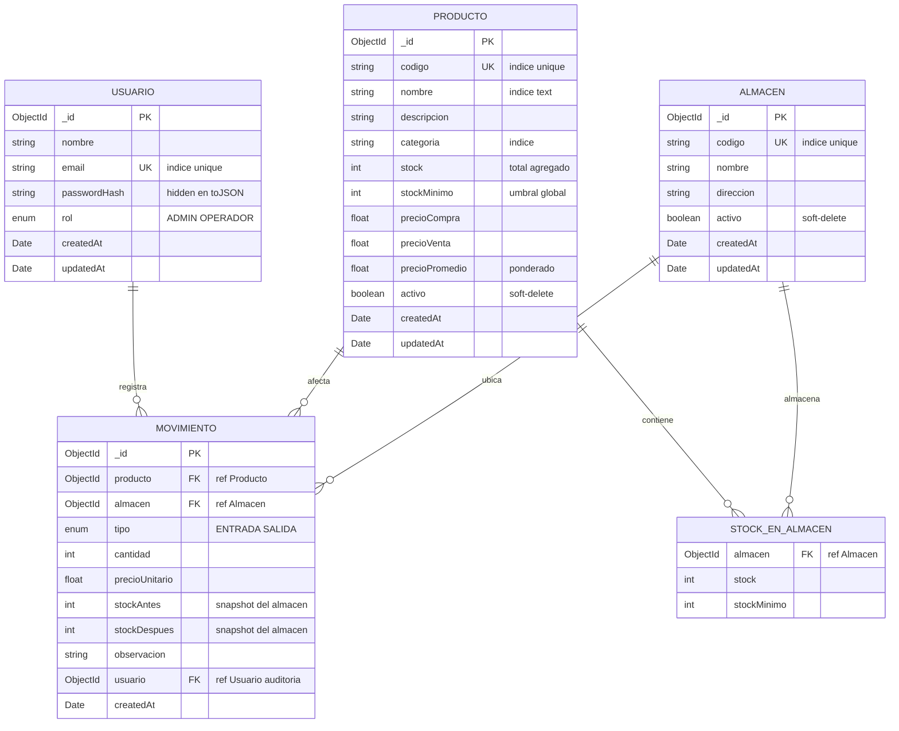

# Sistema de Inventario y Kardex

Solución a la prueba técnica para desarrollador — sistema de gestión de
inventario con control de kardex (entradas/salidas), control preciso de
stock por almacén, precio promedio ponderado, y reportes.

## Tabla de contenidos

- [Entregables](#entregables)
- [Stack](#stack)
- [Estructura del repositorio](#estructura-del-repositorio)
- [Setup local](#setup-local)
- [Variables de entorno](#variables-de-entorno)
- [Documentación interactiva de la API (Apollo Sandbox)](#documentación-interactiva-de-la-api-apollo-sandbox)
- [Seed: datos de prueba](#seed-datos-de-prueba)
- [Funcionalidades implementadas](#funcionalidades-implementadas)
- [Ejemplos de queries GraphQL](#ejemplos-de-queries-graphql)
- [Códigos de error](#códigos-de-error)
- [Diagrama de la base de datos](#diagrama-de-la-base-de-datos)
- [Decisiones técnicas](#decisiones-técnicas)
- [Deploy](#deploy)
- [Comandos útiles](#comandos-útiles)
- [Extras implementados](#extras-implementados)

---

## Entregables

### 2. Documentación

| Entregable | Ubicación |
| ---------- | --------- |
| README con instrucciones de instalación y ejecución | Este archivo (ver [Setup local](#setup-local)) |
| Colección de queries GraphQL (ejemplos) | [Sección Ejemplos de queries GraphQL](#ejemplos-de-queries-graphql) |
| Diagrama de la base de datos | [Sección Diagrama de la base de datos](#diagrama-de-la-base-de-datos) |
| Explicación de decisiones técnicas | [Sección Decisiones técnicas](#decisiones-técnicas) |
| Credenciales de prueba | [Sección Seed](#seed-datos-de-prueba) |

### 3. Demostración

| Entregable | Estado |
| ---------- | ------ |
| Video de 5 minutos mostrando funcionalidades *(opcional)* | Pendiente |
| Deploy funcional (Render + Vercel) | Configs listas (`backend/render.yaml` + Vercel detecta Next.js automático) — ver [Deploy](#deploy) |
| Demo local con un solo comando | `docker compose up -d --build` — ver [Setup Opción A](#opción-a--docker-un-solo-comando-) |

---

## Stack

| Capa       | Tecnología                                                       |
| ---------- | ---------------------------------------------------------------- |
| Backend    | Node.js · Express · Apollo Server v4 (GraphQL) · TypeScript      |
| Frontend   | Next.js 16 (App Router) · React 19 · Tailwind v4 · TypeScript    |
| BD         | MongoDB Atlas (Mongoose 8) — con **transacciones** en kardex     |
| Auth       | JWT (Bearer token) + bcryptjs                                    |
| Validación | Joi (backend) · Yup + Formik (frontend)                          |
| GraphQL    | Apollo Client 3 + cache InMemory                                 |
| Charts     | Recharts                                                         |

**Patrón backend:** Service-Repository con DI container —
`Resolver → Service → Repository → Mongoose`.

---

## Estructura del repositorio

```
inventario-kardex/
├── README.md
├── docker-compose.yml
├── .github/workflows/ci.yml
├── backend/
│   ├── src/
│   │   ├── config/        env + database
│   │   ├── models/        Mongoose schemas (Usuario, Producto, Movimiento, Almacen)
│   │   ├── repositories/  data access layer
│   │   ├── services/      lógica de negocio
│   │   ├── graphql/       typeDefs + resolvers + context
│   │   ├── utils/         errors, jwt, bcrypt, pagination, authGuards
│   │   ├── middlewares/   formatError
│   │   ├── scripts/       seed
│   │   ├── container.ts   DI
│   │   └── index.ts       bootstrap (Apollo + Express)
│   ├── render.yaml        blueprint de deploy
│   ├── Dockerfile         multi-stage
│   └── package.json
└── frontend/
    └── src/
        ├── app/
        │   ├── (auth)/login/         página de login
        │   └── (dashboard)/          rutas protegidas
        │       ├── dashboard/
        │       ├── productos/{nuevo, [id]/editar}
        │       ├── almacenes/        CRUD de almacenes
        │       ├── movimientos/{entrada, salida}
        │       ├── kardex/[id]/
        │       └── reportes/
        ├── components/  ui/, productos/, almacenes/, movimientos/, dashboard/, layout/
        ├── graphql/     auth, productos, almacenes, movimientos, reportes
        ├── lib/         apollo, auth-context, almacen-context, errors, format,
        │                useDebounce, export-kardex, export-reportes
        └── types/       Producto, Almacen, Movimiento, Reporte
```

---

## Setup local

Hay dos formas: **con Docker (recomendado)** o **manual con Node + Atlas**.

### Opción A — Docker (un solo comando) ⚡

Levanta el stack completo (Mongo + Backend + Frontend) con healthchecks
y red interna. **No necesitas instalar Node ni tener MongoDB Atlas.**

```bash
git clone <repo>
cd inventario-kardex
docker compose up -d --build      # construye y levanta todo
```

Tras el primer arranque, corre el seed dentro del contenedor:

```bash
docker compose exec -e NODE_ENV=development backend npm run seed:prod
```

Listo:
- Frontend: http://localhost:3000
- Backend GraphQL: http://localhost:4000/graphql
- Health: http://localhost:4000/health
- Mongo: `mongodb://localhost:27017` (replica set `rs0`)

Logs y manejo:

```bash
docker compose logs -f             # logs en vivo
docker compose ps                   # estado de los servicios
docker compose down                 # detiene (preserva el volumen mongo)
docker compose down -v              # detiene y borra los datos
```

> El `docker-compose.yml` usa multi-stage builds, usuarios non-root,
> healthchecks reales, y `Next.js output: standalone` para una imagen
> de frontend de ~275 MB.

### Opción B — Manual (Node + MongoDB Atlas)

Requisitos: Node.js 20+ · cuenta gratuita en MongoDB Atlas (las
transacciones del kardex requieren replica set).

**Backend:**

```bash
cd backend
cp .env.example .env
# Edita .env con tu MONGODB_URI y un JWT_SECRET (mínimo 16 chars)

npm install
npm run seed         # crea 2 usuarios + 2 almacenes + 10 productos + 26 movimientos
npm run dev          # http://localhost:4000/graphql
```

**Frontend:**

```bash
cd ../frontend
cp .env.local.example .env.local
# NEXT_PUBLIC_GRAPHQL_URL=http://localhost:4000/graphql

npm install
npm run dev          # http://localhost:3000
```

---

## Variables de entorno

### Backend (`backend/.env`)

| Variable          | Default                | Descripción                                      |
| ----------------- | ---------------------- | ------------------------------------------------ |
| `PORT`            | `4000`                 | Puerto HTTP                                      |
| `NODE_ENV`        | `development`          | `development` \| `production` \| `test`          |
| `MONGODB_URI`     | —                      | URI de Atlas (`mongodb+srv://...`)               |
| `JWT_SECRET`      | —                      | Min 16 chars (`openssl rand -hex 32`)            |
| `JWT_EXPIRES_IN`  | `8h`                   | Vida del token                                   |
| `FRONTEND_URL`    | `http://localhost:3000`| URL(s) del frontend, separadas por coma. Previews `*.vercel.app` se aceptan automáticamente |

### Frontend (`frontend/.env.local`)

| Variable                   | Descripción                              |
| -------------------------- | ---------------------------------------- |
| `NEXT_PUBLIC_GRAPHQL_URL`  | URL completa del backend GraphQL         |

---

## Documentación interactiva de la API (Apollo Sandbox)

Al abrir `http://localhost:4000/graphql` en el navegador (en lugar de
hacerle POST con un cliente) Apollo Server v4 sirve **Apollo Sandbox**,
el sucesor moderno de GraphQL Playground. Es la documentación viva de
la API:

- **Schema explorer** — todos los tipos, queries, mutations, inputs y
  enums con descripciones inline.
- **Editor** con autocompletado y validación en vivo.
- **Headers panel** — pega aquí el `Authorization: Bearer <token>` que
  obtienes del login para probar queries protegidas.
- **Documentation panel** — busca un tipo y ves sus campos, deprecaciones
  y comentarios del schema.
- **Historial** local de queries que has corrido.

> La introspección está habilitada también en producción para que el
> evaluador pueda explorar el schema directamente en el deploy
> (`https://<tu-app>.onrender.com/graphql`). Para producción real
> conviene deshabilitarla y servir SDL estático aparte.

**Para probar el flujo completo:**

1. Abre `http://localhost:4000/graphql` → Apollo Sandbox.
2. Ejecuta la mutation `Login` (ver abajo) y copia el `token` del response.
3. En el panel **Headers** agrega:

   | Header          | Value           |
   | --------------- | --------------- |
   | `Authorization` | `Bearer <token>`|

4. Ya puedes correr cualquier query/mutation autenticada.

---

## Seed: datos de prueba

```bash
cd backend && npm run seed
```

Crea:
- **2 usuarios**: 1 admin + 1 operador
- **2 almacenes**: PRINCIPAL (todo el inventario base) + NORTE (con 4 movimientos para demostrar multi-warehouse)
- **10 productos** distribuidos en 5 categorías
- **26 movimientos** (entradas + salidas) backdated a lo largo de los últimos 30 días para que el dashboard tenga datos

### Credenciales de prueba

| Rol      | Email                    | Password         |
| -------- | ------------------------ | ---------------- |
| ADMIN    | admin@inventario.com     | `Admin123!`      |
| OPERADOR | operador@inventario.com  | `Operador123!`   |

---

## Funcionalidades implementadas

### Backend

- **Auth JWT** con rol ADMIN/OPERADOR y guards `requireAuth` / `requireRole`
- **CRUD de productos** con soft-delete + restauración
- **CRUD de almacenes** con soft-delete (no permite eliminar el último activo)
- **Kardex transaccional por almacén**: cada movimiento usa `session.withTransaction` para garantizar atomicidad de stock + movimiento; stock se valida y actualiza per-warehouse
- **Precio promedio ponderado** recalculado en cada entrada (sobre el stock global del producto)
- **Validaciones Joi** en todos los services
- **Errores tipados** con `extensions.code` (8 códigos: UNAUTHENTICATED, FORBIDDEN, VALIDATION_ERROR, NOT_FOUND, DUPLICATE_KEY, INSUFFICIENT_STOCK, INVALID_CREDENTIALS, BUSINESS_RULE)
- **Reportes scoped por almacén**: dashboardMetrics, productosStockBajo, topProductosMovidos, reporteInventario, movimientosPorDia y movimientosUltimos aceptan `almacenId` opcional
- **Health check** en `/health` para Render
- **CORS** multi-origen (lista + previews Vercel)

### Frontend

- Login con Formik + Yup, persistencia de token, auto-logout en `UNAUTHENTICATED`
- Layout protegido con AuthGuard, Sidebar (drawer en mobile), Topbar con switcher global de almacén
- **Switcher global de almacén** en Topbar: scope automático de dashboard, productos, reportes, movimientos y kardex; persistencia en localStorage
- **Productos**: tabla con búsqueda debounced, filtros (categoría + estado + almacén), paginación, formulario crear/editar, modal soft-delete (solo ADMIN), restaurar eliminados
- **Almacenes**: CRUD completo con modal de creación/edición, soft-delete protegido
- **Movimientos**: ProductoSelector con stock visible, AlmacenSelector requerido, validación tiempo real (cantidad > 0, en SALIDA cantidad ≤ stock-en-almacén), modal de confirmación con resumen, historial filtrable por tipo + almacén + fechas
- **Kardex por producto**: header con métricas (stock, precio promedio, valor inventario), código de barras CODE128, gráfico de historial de precios, tabla con stockAntes/Despues, filtros por tipo + rango fechas + almacén, export Excel/PDF
- **Dashboard**: 5 MetricCards (polling 60s, scoped por almacén), gráfico Recharts entradas vs salidas 30 días, lista lateral de stock bajo, últimos movimientos
- **Reportes**: 3 totales + chart + tabla por categoría con tfoot + top 5 productos movidos + tabla stock bajo, export Excel/PDF, todo scoped por almacén
- **MoneyInput** con formateo en vivo (separador de miles + cursor estable) en COP
- Toast notifications mapeados desde codes del backend (mensajes amigables)
- Responsive completo + skeleton loaders + empty states

### Cobertura de criterios de evaluación

| Criterio          | Peso | Estado |
| ----------------- | ---- | ------ |
| Funcionalidad     | 30%  | ✅     |
| Lógica de Kardex  | 20%  | ✅ con transacciones + precio promedio probado matemáticamente |
| GraphQL           | 15%  | ✅ schema modular, errores tipados, validación Joi |
| Frontend          | 15%  | ✅ responsive, feedback visual, confirmaciones |
| Autenticación     | 10%  | ✅ JWT + roles + auto-logout |
| Base de Datos     | 5%   | ✅ índices compuestos, transacciones, soft-delete |
| Calidad código    | 5%   | ✅ Service-Repository + DI + TypeScript estricto |

---

## Ejemplos de queries GraphQL

Endpoint: `http://localhost:4000/graphql`

> Cualquier query (excepto `autenticarUsuario`) requiere el header
> `Authorization: Bearer <token>`. El token se obtiene del login.

### Auth

```graphql
mutation Login {
  autenticarUsuario(email: "admin@inventario.com", password: "Admin123!") {
    token
    usuario {
      _id
      nombre
      email
      rol
    }
  }
}

query Me {
  me {
    _id
    nombre
    email
    rol
  }
}

# Solo ADMIN
mutation CrearUsuario {
  crearUsuario(input: {
    nombre: "Operador 2"
    email: "operador2@inventario.com"
    password: "Operador123!"
    rol: OPERADOR
  }) {
    _id
    nombre
    rol
  }
}
```

### Productos

```graphql
query Productos {
  productos(filtro: {
    busqueda: "laptop"
    categoria: "Electronica"
    estadoStock: BAJO
    page: 1
    pageSize: 10
  }) {
    items {
      _id codigo nombre stock stockMinimo
      precioVenta precioPromedio estadoStock
      stockPorAlmacen { stock almacen { codigo nombre } }
    }
    total page totalPages
  }
}

query Producto {
  producto(id: "<id>") {
    _id codigo nombre descripcion categoria
    stock stockMinimo precioCompra precioVenta precioPromedio
    estadoStock activo createdAt
  }
}

mutation CrearProducto {
  crearProducto(input: {
    codigo: "ELEC-099"
    nombre: "Mouse Logitech MX Master"
    descripcion: "Mouse inalambrico ergonomico"
    categoria: "Electronica"
    stockMinimo: 5
    precioCompra: 75
    precioVenta: 110
  }) {
    _id codigo estadoStock
  }
}

mutation ActualizarProducto {
  actualizarProducto(
    id: "<id>"
    input: { precioVenta: 1300, stockMinimo: 3 }
  ) {
    _id precioVenta stockMinimo
  }
}

# Soft-delete, solo ADMIN
mutation EliminarProducto {
  eliminarProducto(id: "<id>") { _id activo }
}

query Categorias {
  categorias
}
```

### Almacenes

```graphql
query Almacenes {
  almacenes(activo: true) {
    _id codigo nombre direccion activo
  }
}

# Solo ADMIN
mutation CrearAlmacen {
  crearAlmacen(input: {
    codigo: "SUR"
    nombre: "Bodega Sur"
    direccion: "Calle 80 #15-30"
  }) {
    _id codigo
  }
}
```

### Movimientos / Kardex

```graphql
# Transacción atómica: actualiza stock del almacén y crea registro
mutation RegistrarEntrada {
  registrarEntrada(input: {
    productoId: "<id>"
    almacenId: "<id>"
    cantidad: 10
    precioUnitario: 850
    observacion: "Compra a proveedor X"
  }) {
    _id tipo cantidad stockAntes stockDespues
    producto { stock precioPromedio }
  }
}

# Falla con INSUFFICIENT_STOCK si cantidad > stock del almacén
mutation RegistrarSalida {
  registrarSalida(input: {
    productoId: "<id>"
    almacenId: "<id>"
    cantidad: 2
    precioUnitario: 1200
    observacion: "Venta cliente A"
  }) {
    _id stockAntes stockDespues
  }
}

query Movimientos {
  movimientos(filtro: {
    productoId: "<id>"
    tipo: ENTRADA
    desde: "2026-04-01T00:00:00Z"
    hasta: "2026-04-30T23:59:59Z"
    page: 1
    pageSize: 20
  }) {
    items {
      _id tipo cantidad stockAntes stockDespues
      precioUnitario observacion createdAt
      producto { codigo nombre }
      almacen { codigo nombre }
      usuario { nombre rol }
    }
    total totalPages
  }
}

query Kardex {
  kardexProducto(productoId: "<id>") {
    _id tipo cantidad stockAntes stockDespues
    precioUnitario createdAt
  }
}
```

### Reportes / Dashboard

Todas aceptan `almacenId` opcional para scopear per-warehouse.

```graphql
query DashboardMetrics {
  dashboardMetrics {
    totalProductos
    productosStockBajo
    productosAgotados
    valorInventario
    movimientosHoy
  }
}

query MovimientosPorDia {
  movimientosPorDia(dias: 30) {
    fecha entradas salidas
  }
}

query StockBajo {
  productosStockBajo {
    _id codigo nombre stock stockMinimo estadoStock
  }
}

query TopMovidos {
  topProductosMovidos(limite: 5, dias: 30) {
    producto { codigo nombre }
    totalMovimientos totalCantidad
  }
}

query ReporteInventario {
  reporteInventario {
    totalProductos
    valorTotal
    porCategoria { categoria cantidadProductos valorTotal }
  }
}
```

### Ejemplo curl: login + dashboard

```bash
TOKEN=$(curl -s -X POST http://localhost:4000/graphql \
  -H "Content-Type: application/json" \
  -d '{"query":"mutation { autenticarUsuario(email:\"admin@inventario.com\", password:\"Admin123!\") { token } }"}' \
  | jq -r '.data.autenticarUsuario.token')

curl -X POST http://localhost:4000/graphql \
  -H "Content-Type: application/json" \
  -H "Authorization: Bearer $TOKEN" \
  -d '{"query":"query { dashboardMetrics { totalProductos valorInventario movimientosHoy } }"}'
```

---

## Códigos de error

Todos los errores devuelven `extensions.code` para que el frontend los mapee a mensajes amigables sin parsear strings:

| Code                  | Caso                                                      |
| --------------------- | --------------------------------------------------------- |
| `UNAUTHENTICATED`     | Falta token o es inválido                                 |
| `FORBIDDEN`           | Rol insuficiente (ej. OPERADOR llamando crearUsuario)     |
| `VALIDATION_ERROR`    | Input falla validación Joi                                |
| `NOT_FOUND`           | Recurso (producto, movimiento, almacén) no existe         |
| `DUPLICATE_KEY`       | Email o código duplicado                                  |
| `INSUFFICIENT_STOCK`  | Salida con cantidad > stock del almacén                   |
| `INVALID_CREDENTIALS` | Email o password incorrectos en login                     |
| `BUSINESS_RULE`       | Movimiento sobre producto/almacén inactivo, etc.          |

---

## Diagrama de la base de datos

MongoDB con cuatro colecciones. Mongoose como ODM. Las relaciones son
por referencia (`ObjectId` con `populate`); el stock por almacén está
embebido en el producto como sub-array (`stockPorAlmacen`) por
performance de lectura.



### Índices

| Colección     | Índice                                       | Tipo      | Propósito                                         |
| ------------- | -------------------------------------------- | --------- | ------------------------------------------------- |
| `usuarios`    | `{ email: 1 }`                               | unique    | Login + duplicate check                           |
| `almacenes`   | `{ codigo: 1 }`                              | unique    | Lookup por código                                 |
| `almacenes`   | `{ activo: 1 }`                              | regular   | Filtro de soft-delete                             |
| `productos`   | `{ codigo: 1 }`                              | unique    | Búsqueda por código + duplicate check             |
| `productos`   | `{ nombre: "text", descripcion: "text" }`    | text      | Búsqueda full-text en lista                       |
| `productos`   | `{ categoria: 1, activo: 1 }`                | compuesto | Filtro por categoría con soft-delete              |
| `productos`   | `{ stock: 1 }`                               | regular   | Reportes de stock bajo                            |
| `productos`   | `{ stockPorAlmacen.almacen: 1 }`             | regular   | Lookup de stock por almacén                       |
| `movimientos` | `{ producto: 1, createdAt: -1 }`             | compuesto | Kardex de un producto en orden cronológico        |
| `movimientos` | `{ producto: 1, almacen: 1, createdAt: -1 }` | compuesto | Kardex per-warehouse                              |
| `movimientos` | `{ almacen: 1, createdAt: -1 }`              | compuesto | Movimientos de un almacén                         |
| `movimientos` | `{ tipo: 1, createdAt: -1 }`                 | compuesto | Filtro por tipo + recientes                       |
| `movimientos` | `{ usuario: 1, createdAt: -1 }`              | compuesto | Auditoría por usuario                             |
| `movimientos` | `{ createdAt: -1 }`                          | regular   | Listado global por recencia                       |

### Reglas de negocio

- **`stockAntes` y `stockDespues`** son snapshots del almacén específico en cada movimiento. El movimiento es inmutable, así que aunque después se editen los precios o se haga rollback de stock, el kardex sigue siendo trazable.
- **`precioPromedio`** se recalcula sólo en `ENTRADA`: `(stockActual * precioPromedio + cantidad * precioEntrada) / (stock + cantidad)`. En `SALIDA` no cambia. Si `stock = 0` antes de la entrada, el promedio se resetea al precio de entrada. Se calcula sobre el stock global del producto (criterio: el costo se considera unificado a nivel producto, no por almacén).
- **Soft-delete** en productos y almacenes preserva la integridad referencial del kardex: los movimientos siguen apuntando a productos/almacenes inactivos, así que el historial nunca se pierde.
- **Atomicidad**: cada movimiento se hace dentro de una transacción Mongo (`session.withTransaction`) que cubre: lectura del producto + almacén, validación de stock (en SALIDA), update del subdoc `stockPorAlmacen` y create del movimiento.
- **Auditoría**: el campo `usuario` se llena automáticamente desde el contexto JWT en el resolver, no es input del cliente.

---

## Decisiones técnicas

### 1. Patrón Service-Repository

Backend dividido en tres capas: **Resolver → Service → Repository**.

- Los **resolvers** son delgados (orquestación pura). Si tienen lógica, es difícil testear sin levantar GraphQL.
- Los **services** concentran reglas de negocio. Se testean con mocks de repositories sin depender de Mongo.
- Los **repositories** encapsulan Mongoose. Si mañana cambia la DB (PostgreSQL, etc.), solo se reescribe esta capa.

Alternativa descartada: resolvers que llaman directo a modelos Mongoose. Más simple pero acopla lógica con persistencia y dificulta testing.

### 2. Transacciones de MongoDB en el kardex

Cada `registrarEntrada` / `registrarSalida` ocurre dentro de una transacción Mongo (`session.withTransaction`).

- Un movimiento implica DOS escrituras: actualizar `Producto.stockPorAlmacen[i]` y crear `Movimiento`.
- Sin transacción, si la segunda falla, el sistema queda inconsistente (stock cambió pero no hay registro de auditoría — peor escenario para un kardex).
- MongoDB con replica set soporta transacciones desde v4.0 (Atlas o el `docker-compose.yml` incluido).

Trade-off: las transacciones tienen costo de performance, pero la integridad de un kardex es no-negociable.

### 3. Precio promedio ponderado

Recalcular el `precioPromedio` del producto en cada entrada con la fórmula:

```
nuevoPromedio = (stockActual × precioPromedio + cantidadEntrada × precioEntrada)
                / (stockActual + cantidadEntrada)
```

- Es el método estándar contable cuando entran lotes a precios distintos.
- Se calcula incrementalmente: no requiere recorrer todo el histórico.
- Las salidas NO modifican el promedio (consumen al precio promedio vigente).
- Si `stockActual === 0`, el nuevo promedio es directamente `precioEntrada` (evita división por cero y refleja que se "reinicia" el lote).

### 4. `stockAntes` y `stockDespues` en cada movimiento

Persistir explícitamente ambos valores en el documento `Movimiento`.

- La esencia de un kardex es responder "¿cuál era el stock en este punto del tiempo?" sin reconstruirlo.
- Permite detectar inconsistencias: si en la fila N el `stockDespues` no es igual al `stockAntes` de la fila N+1, hubo manipulación o bug.
- Es información de auditoría inmutable.

Costo: datos algo redundantes, pero es lo correcto para un sistema de inventario.

### 5. Soft-delete en productos y almacenes

Eliminar productos/almacenes cambia `activo: false` en lugar de borrar el documento.

- Los movimientos históricos referencian productos y almacenes. Un hard-delete rompería la integridad del kardex (movimientos huérfanos).
- La prueba menciona "restaurar productos eliminados" como funcionalidad extra → soft-delete lo habilita gratis.
- En la UI, productos inactivos no aparecen en selectores ni listados por defecto, pero sí en reportes históricos.

Trade-off: las queries deben filtrar por `activo: true` por defecto.

### 6. JWT en localStorage (no httpOnly cookie)

Para esta prueba, almacenar el JWT en `localStorage` del navegador.

- Simplifica el setup: no requiere configurar cookies cross-domain, CSRF tokens, ni `credentials: 'include'`.
- Backend en Render + Frontend en Vercel viven en dominios distintos; cookies cross-site requieren configuración adicional.

Mitigación de riesgo XSS: Tailwind no introduce HTML dinámico, no usamos `dangerouslySetInnerHTML`, todas las dependencias son estables.

Para producción real: httpOnly cookie + Refresh Token + rotación.

### 7. Apollo Client cache como state manager

No usar Redux ni Zustand; el caché normalizado de Apollo + Context para sesión y almacén actual es suficiente.

- El estado de la app es mayoritariamente datos del servidor (productos, movimientos). Apollo ya los normaliza por `_id`.
- El único estado verdaderamente global cliente-side son la sesión y el almacén seleccionado → Context API.
- Menos dependencias = menos bugs de sincronización entre stores.

### 8. Validación en dos capas (Joi backend, Yup frontend)

Validar el mismo input en ambos lados.

- **Frontend (Yup):** UX inmediata, no espera al servidor.
- **Backend (Joi):** seguridad — no se puede confiar en validaciones de cliente.
- Esquemas separados aceptables porque las versiones cambian a velocidades distintas.

### 9. Errores tipados con `extensions.code`

Cada error del servidor extiende `GraphQLError` con un `code` específico (ej. `INSUFFICIENT_STOCK`, `DUPLICATE_KEY`).

- El frontend mapea los codes a mensajes amigables sin parsear strings.
- 8 códigos cubren el 100% de los casos de error del sistema.

### 10. Multi-almacén con stock embebido

`Producto.stockPorAlmacen` es un sub-array `[{ almacen, stock, stockMinimo }]`, no una colección separada.

- Cada lectura de producto trae su stock por almacén sin joins (un solo round-trip a Mongo).
- El stock global (`Producto.stock`) se mantiene como total agregado para queries rápidas y reportes consolidados.
- El `MovimientoService` actualiza el subdoc del almacén correcto y recalcula el total dentro de la misma transacción.

Trade-off: si el número de almacenes crece a cientos, conviene migrar a colección separada con índice. Para escala razonable (decenas de almacenes), embebido es óptimo.

### 11. Next.js 16 (App Router) + React 19 + Tailwind v4

Stack actual de Next/React.

- Route groups `(auth)` y `(dashboard)` permiten layouts distintos sin afectar la URL.
- Tailwind v4 usa configuración CSS-first (sin `tailwind.config.ts`, todo en `globals.css`).
- `Next.js output: 'standalone'` produce una imagen Docker minimal (~275 MB).

### 12. Despliegue Render + Vercel

Backend en Render (Web Service), frontend en Vercel.

- Sugerido por la prueba.
- Ambos tienen tier gratuito.
- Vercel está optimizado para Next.js (cero config).
- Render levanta Node + variables de entorno fácil.

Limitación conocida: Render free duerme tras 15 min de inactividad → primer request cold-start ~30s. Aceptable para demo.

---

## Deploy

### Backend a Render

1. New > Blueprint > apuntar a este repo (rootDir = `backend`)
2. El `backend/render.yaml` configura: build, start, health check, autoDeploy
3. Variables a pegar en el dashboard:
   - `MONGODB_URI` — desde Atlas
   - `FRONTEND_URL` — `https://<tu-app>.vercel.app`
   - `JWT_SECRET` — Render lo genera con `generateValue: true`

### Frontend a Vercel

1. Import Project > apuntar al repo (root directory = `frontend`)
2. Vercel detecta Next.js automáticamente
3. Variable: `NEXT_PUBLIC_GRAPHQL_URL` = `https://<tu-app>.onrender.com/graphql`

### Notas de deploy

- El primer request al backend en Render free tier puede tardar ~30s (cold start). Los siguientes son rápidos.
- El CORS del backend acepta cualquier `*.vercel.app` para soportar previews automáticamente.

---

## Comandos útiles

```bash
# Backend
npm run dev           # ts-node-dev con hot reload
npm run build         # tsc → dist/
npm run start         # node dist/index.js
npm run seed          # poblar BD con datos de prueba
npm run type-check    # tsc --noEmit
npm test              # Jest: 22 tests del MovimientoService
npm run test:coverage # con coverage report

# Frontend
npm run dev           # next dev
npm run build         # producción optimizada
npm run start         # next start (sobre el build)
npm run lint          # eslint

# Docker (full stack)
docker compose up -d --build   # construye + levanta Mongo + backend + frontend
docker compose logs -f          # logs en vivo
docker compose down             # detiene (preserva volumen)
docker compose down -v          # detiene + borra datos
```

---

## Extras implementados

Cobertura de **PARTE 3 - Extras** del PDF:

| # | Extra | Estado |
| - | ----- | ------ |
| 1 | Exportar reportes a Excel/PDF | ✅ kardex (`/kardex/[id]`) **y** reportes (`/reportes`) |
| 2 | Códigos de barras para productos | ✅ CODE128 (jsbarcode) en header del kardex |
| 3 | Alertas por email cuando stock bajo mínimo | ❌ omitido |
| 4 | Gráficos interactivos | ✅ Recharts en dashboard + reportes + historial precios |
| 5 | Historial de precios | ✅ LineChart con la serie de precios de las entradas en `/kardex/[id]` |
| 6 | Múltiples almacenes/sucursales | ✅ con stock real per-warehouse + switcher global |
| 7 | Restaurar productos eliminados | ✅ toggle en `/productos` (solo ADMIN) |

Mejoras técnicas adicionales (corresponden a la sección "Mejoras Técnicas" del PDF):

- **TypeScript estricto** en backend y frontend (`tsc --noEmit` limpio).
- **Tests Jest** — 22 tests del `MovimientoService` (precio promedio ponderado, transacciones, validaciones Joi, almacén inactivo).
- **Docker full-stack** — `docker compose up` levanta Mongo (replica set) + backend + frontend. Multi-stage Dockerfiles, non-root users, healthchecks reales, Next.js standalone output (~275 MB).
- **CI/CD básico** — GitHub Actions con jobs separados backend (type-check + test + build + coverage) y frontend (type-check + lint + build).
- **Documentación de API con Apollo Sandbox** — abrir `http://localhost:4000/graphql` en el navegador da el explorer interactivo del schema (sucesor moderno de GraphQL Playground). Ver [sección Apollo Sandbox](#documentación-interactiva-de-la-api-apollo-sandbox).

Mejoras UX:

- **Switcher global de almacén** en el Topbar — cambia el scope de dashboard, productos, reportes, movimientos y kardex con un click. Persiste en localStorage.
- **MoneyInput** con formateo en vivo (separador de miles + cursor estable) en COP.
- **Auto-logout** en `UNAUTHENTICATED`: el frontend limpia el token y redirige a `/login?reason=expired` con toast.
- **CORS multi-origen** — el backend acepta lista coma-separada + cualquier `*.vercel.app` para previews automáticos.
- **Pre-selección inteligente** de producto y precio cuando entras a `/movimientos/entrada` desde el kardex.
