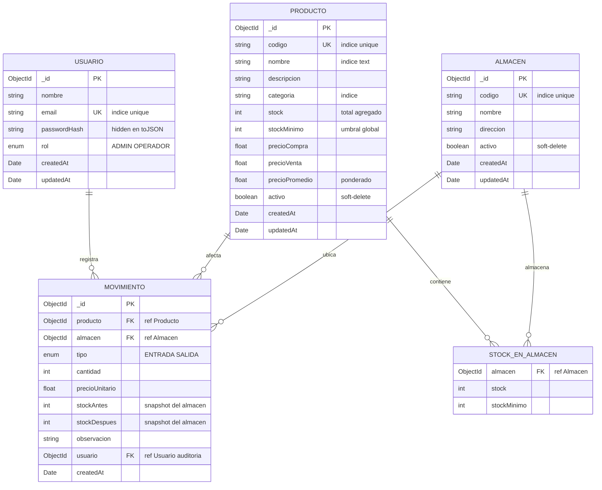

# Sistema de Inventario y Kardex

Solucion a la prueba tecnica. Un sistema de inventario con kardex
(entradas/salidas), stock real por almacen, precio promedio ponderado
y reportes. Backend en Node + Apollo Server v4, frontend en Next.js,
MongoDB con replica set y todo orquestado con docker compose.

Repo: https://github.com/daniel453/aoa_prueba_tecnica.git

URLs vivas:

- Frontend: https://aoapruebatecnica.danielrodriguezstudio.com
- Backend GraphQL: https://apiaoapruebatecnica.danielrodriguezstudio.com/graphql

## Tabla de contenidos

- [Entregables](#entregables)
- [Stack](#stack)
- [Estructura del repositorio](#estructura-del-repositorio)
- [Setup local](#setup-local)
- [Variables de entorno](#variables-de-entorno)
- [Documentacion interactiva de la API (Apollo Sandbox)](#documentacion-interactiva-de-la-api-apollo-sandbox)
- [Seed: datos de prueba](#seed-datos-de-prueba)
- [Funcionalidades implementadas](#funcionalidades-implementadas)
- [Ejemplos de queries GraphQL](#ejemplos-de-queries-graphql)
- [Codigos de error](#codigos-de-error)
- [Diagrama de la base de datos](#diagrama-de-la-base-de-datos)
- [Decisiones tecnicas](#decisiones-tecnicas)
- [Deploy](#deploy)
- [Comandos utiles](#comandos-utiles)
- [Extras implementados](#extras-implementados)

---

## Entregables

Mapeo directo a lo que pide el PDF de la prueba.

**Documentacion:**

- README con instrucciones de instalacion y ejecucion: este archivo, ver [Setup local](#setup-local).
- Coleccion de queries GraphQL: ver [Ejemplos de queries GraphQL](#ejemplos-de-queries-graphql).
- Diagrama de la base de datos: ver [Diagrama de la base de datos](#diagrama-de-la-base-de-datos).
- Decisiones tecnicas: ver [Decisiones tecnicas](#decisiones-tecnicas).
- Credenciales de prueba: ver [Seed](#seed-datos-de-prueba).

**Demostracion:**

- Deploy funcional: https://aoapruebatecnica.danielrodriguezstudio.com (frontend)
  y https://apiaoapruebatecnica.danielrodriguezstudio.com/graphql (backend).
- Demo local con un solo comando: `docker compose up -d --build`.

---

## Stack

| Capa       | Tecnologia                                                       |
| ---------- | ---------------------------------------------------------------- |
| Backend    | Node.js, Express, Apollo Server v4 (GraphQL), TypeScript         |
| Frontend   | Next.js 16 (App Router), React 19, Tailwind v4, TypeScript       |
| BD         | MongoDB con replica set (Mongoose 8) — transacciones reales      |
| Auth       | JWT (Bearer token) + bcryptjs                                    |
| Validacion | Joi en backend, Yup + Formik en frontend                         |
| GraphQL    | Apollo Client 3 + cache InMemory                                 |
| Charts     | Recharts                                                         |

El backend sigue Service-Repository con un container DI:
`Resolver -> Service -> Repository -> Mongoose`. La idea es que los
resolvers queden delgados y la logica de negocio sea testeable sin
levantar GraphQL.

---

## Estructura del repositorio

```
inventario-kardex/
├── README.md
├── docker-compose.yml
├── .github/workflows/ci.yml
├── backend/
│   ├── src/
│   │   ├── config/        env + database
│   │   ├── models/        Mongoose schemas (Usuario, Producto, Movimiento, Almacen)
│   │   ├── repositories/  data access layer
│   │   ├── services/      logica de negocio
│   │   ├── graphql/       typeDefs + resolvers + context
│   │   ├── utils/         errors, jwt, bcrypt, pagination, authGuards
│   │   ├── middlewares/   formatError
│   │   ├── scripts/       seed
│   │   ├── container.ts   DI
│   │   └── index.ts       bootstrap (Apollo + Express)
│   ├── render.yaml        legacy, ver nota en Deploy
│   ├── Dockerfile         multi-stage
│   └── package.json
└── frontend/
    └── src/
        ├── app/
        │   ├── (auth)/login/         pagina de login
        │   └── (dashboard)/          rutas protegidas
        │       ├── dashboard/
        │       ├── productos/{nuevo, [id]/editar}
        │       ├── almacenes/        CRUD de almacenes
        │       ├── movimientos/{entrada, salida}
        │       ├── kardex/[id]/
        │       └── reportes/
        ├── components/  ui/, productos/, almacenes/, movimientos/, dashboard/, layout/
        ├── graphql/     auth, productos, almacenes, movimientos, reportes
        ├── lib/         apollo, auth-context, almacen-context, errors, format,
        │                useDebounce, export-kardex, export-reportes
        └── types/       Producto, Almacen, Movimiento, Reporte
```

---

## Setup local

Hay dos caminos: con Docker (lo recomiendo) o manual con Node + un
Mongo con replica set.

### Opcion A — Docker (un solo comando)

Levanta el stack completo (Mongo + Backend + Frontend) con healthchecks
y red interna. No necesitas tener Node instalado ni MongoDB Atlas.

```bash
git clone https://github.com/daniel453/aoa_prueba_tecnica.git
cd aoa_prueba_tecnica
docker compose up -d --build
```

Tras el primer arranque, corre el seed dentro del contenedor:

```bash
docker compose exec -e NODE_ENV=development backend npm run seed:prod
```

Y queda listo:

- Frontend: http://localhost:3000
- Backend GraphQL: http://localhost:4000/graphql
- Health: http://localhost:4000/health
- Mongo: `mongodb://localhost:27017` (replica set `rs0`)

Manejo basico:

```bash
docker compose logs -f             # logs en vivo
docker compose ps                  # estado de los servicios
docker compose down                # detiene (preserva el volumen de mongo)
docker compose down -v             # detiene y borra los datos
```

El `docker-compose.yml` usa multi-stage builds, usuarios non-root,
healthchecks reales, y `Next.js output: standalone`. La imagen de
frontend queda en ~275 MB.

### Opcion B — Manual (Node + Mongo con replica set)

Requisitos: Node.js 20+ y un Mongo en replica set (las transacciones
del kardex no funcionan con un standalone). Si no quieres montar el
replica set local, lo mas rapido es Atlas.

Backend:

```bash
cd backend
cp .env.example .env
# Edita .env con tu MONGODB_URI y un JWT_SECRET (minimo 16 chars)

npm install
npm run seed         # crea 2 usuarios + 2 almacenes + 10 productos + 26 movimientos
npm run dev          # http://localhost:4000/graphql
```

Frontend:

```bash
cd ../frontend
cp .env.local.example .env.local
# NEXT_PUBLIC_GRAPHQL_URL=http://localhost:4000/graphql

npm install
npm run dev          # http://localhost:3000
```

---

## Variables de entorno

### Backend (`backend/.env`)

| Variable          | Default                | Descripcion                                    |
| ----------------- | ---------------------- | ---------------------------------------------- |
| `PORT`            | `4000`                 | Puerto HTTP                                    |
| `NODE_ENV`        | `development`          | `development` \| `production` \| `test`        |
| `MONGODB_URI`     | —                      | URI de Mongo (replica set requerido)           |
| `JWT_SECRET`      | —                      | Min 16 chars (`openssl rand -hex 32`)          |
| `JWT_EXPIRES_IN`  | `8h`                   | Vida del token                                 |
| `FRONTEND_URL`    | `http://localhost:3000`| URL(s) del frontend separadas por coma         |

### Frontend (`frontend/.env.local`)

| Variable                   | Descripcion                              |
| -------------------------- | ---------------------------------------- |
| `NEXT_PUBLIC_GRAPHQL_URL`  | URL completa del backend GraphQL         |

---

## Documentacion interactiva de la API (Apollo Sandbox)

Si abres `http://localhost:4000/graphql` (o el endpoint en produccion)
en el navegador en lugar de hacerle POST, Apollo Server v4 sirve
Apollo Sandbox: el sucesor moderno de GraphQL Playground. Lo dejo
como documentacion viva del schema:

- Schema explorer con todos los tipos, queries, mutations, inputs y enums.
- Editor con autocompletado y validacion en vivo.
- Headers panel para pegar `Authorization: Bearer <token>` y probar queries protegidas.
- Documentation panel: busqueda de tipos con campos y comentarios.
- Historial local de queries.

Dejo la introspeccion habilitada tambien en produccion para que el
evaluador pueda explorar el schema en el deploy. Ojo: en una app real
yo desactivaria introspeccion en produccion y serviria SDL estatico
aparte.

Flujo para probarlo:

1. Abre `http://localhost:4000/graphql` (o el endpoint de prod) → Apollo Sandbox.
2. Ejecuta la mutation `Login` (mas abajo) y copia el `token` del response.
3. En el panel **Headers** agrega:

   | Header          | Value           |
   | --------------- | --------------- |
   | `Authorization` | `Bearer <token>`|

4. Ya puedes correr cualquier query/mutation autenticada.

---

## Seed: datos de prueba

```bash
cd backend && npm run seed
```

Crea:

- 2 usuarios (un admin y un operador).
- 2 almacenes: PRINCIPAL (todo el inventario base) y NORTE (con 4 movimientos para demostrar multi-warehouse).
- 10 productos en 5 categorias.
- 26 movimientos backdated a lo largo de los ultimos 30 dias para que el dashboard tenga datos reales que mostrar.

### Credenciales de prueba

| Rol      | Email                    | Password         |
| -------- | ------------------------ | ---------------- |
| ADMIN    | admin@inventario.com     | `Admin123!`      |
| OPERADOR | operador@inventario.com  | `Operador123!`   |

---

## Funcionalidades implementadas

### Backend

- Auth JWT con roles ADMIN/OPERADOR y guards `requireAuth` / `requireRole`.
- CRUD de productos con soft-delete + restauracion.
- CRUD de almacenes con soft-delete (no permite eliminar el ultimo activo).
- Kardex transaccional por almacen: cada movimiento usa `session.withTransaction` para garantizar atomicidad de stock + movimiento. El stock se valida y actualiza per-warehouse.
- Precio promedio ponderado recalculado en cada entrada (sobre el stock global del producto).
- Validaciones Joi en todos los services.
- Errores tipados con `extensions.code` (8 codigos: UNAUTHENTICATED, FORBIDDEN, VALIDATION_ERROR, NOT_FOUND, DUPLICATE_KEY, INSUFFICIENT_STOCK, INVALID_CREDENTIALS, BUSINESS_RULE).
- Reportes scoped por almacen: `dashboardMetrics`, `productosStockBajo`, `topProductosMovidos`, `reporteInventario`, `movimientosPorDia` y `movimientosUltimos` aceptan `almacenId` opcional.
- Health check en `/health`.
- CORS multi-origen (lista coma-separada por env var).

### Frontend

- Login con Formik + Yup, persistencia de token, auto-logout en `UNAUTHENTICATED`.
- Layout protegido con AuthGuard, Sidebar (drawer en mobile), Topbar con switcher global de almacen.
- **Switcher global de almacen** en Topbar: scope automatico de dashboard, productos, reportes, movimientos y kardex; persistencia en localStorage.
- Productos: tabla con busqueda debounced, filtros (categoria + estado + almacen), paginacion, formulario crear/editar, modal soft-delete (solo ADMIN), restaurar eliminados.
- Almacenes: CRUD completo con modal de creacion/edicion, soft-delete protegido.
- Movimientos: ProductoSelector con stock visible, AlmacenSelector requerido, validacion en tiempo real (cantidad > 0, en SALIDA cantidad <= stock-en-almacen), modal de confirmacion con resumen, historial filtrable por tipo + almacen + fechas.
- Kardex por producto: header con metricas (stock, precio promedio, valor inventario), codigo de barras CODE128, grafico de historial de precios, tabla con stockAntes/Despues, filtros por tipo + rango fechas + almacen, export Excel/PDF.
- Dashboard: 5 MetricCards (polling 60s, scoped por almacen), grafico Recharts entradas vs salidas a 30 dias, lista lateral de stock bajo, ultimos movimientos.
- Reportes: 3 totales + chart + tabla por categoria con tfoot + top 5 productos movidos + tabla stock bajo, export Excel/PDF, todo scoped por almacen.
- MoneyInput con formateo en vivo (separador de miles + cursor estable) en COP.
- Toast notifications mapeados desde codes del backend (mensajes amigables).
- Responsive completo, skeleton loaders y empty states.

---

## Ejemplos de queries GraphQL

Endpoint local: `http://localhost:4000/graphql`. Endpoint en prod:
`https://apiaoapruebatecnica.danielrodriguezstudio.com/graphql`.

Cualquier query (excepto `autenticarUsuario`) requiere el header
`Authorization: Bearer <token>`. El token sale del login.

### Auth

```graphql
mutation Login {
  autenticarUsuario(email: "admin@inventario.com", password: "Admin123!") {
    token
    usuario { _id nombre email rol }
  }
}

query Me {
  me { _id nombre email rol }
}

# Solo ADMIN
mutation CrearUsuario {
  crearUsuario(input: {
    nombre: "Operador 2"
    email: "operador2@inventario.com"
    password: "Operador123!"
    rol: OPERADOR
  }) {
    _id nombre rol
  }
}
```

### Productos

```graphql
query Productos {
  productos(filtro: {
    busqueda: "laptop"
    categoria: "Electronica"
    estadoStock: BAJO
    page: 1
    pageSize: 10
  }) {
    items {
      _id codigo nombre stock stockMinimo
      precioVenta precioPromedio estadoStock
      stockPorAlmacen { stock almacen { codigo nombre } }
    }
    total page totalPages
  }
}

query Producto {
  producto(id: "<id>") {
    _id codigo nombre descripcion categoria
    stock stockMinimo precioCompra precioVenta precioPromedio
    estadoStock activo createdAt
  }
}

mutation CrearProducto {
  crearProducto(input: {
    codigo: "ELEC-099"
    nombre: "Mouse Logitech MX Master"
    descripcion: "Mouse inalambrico ergonomico"
    categoria: "Electronica"
    stockMinimo: 5
    precioCompra: 75
    precioVenta: 110
  }) {
    _id codigo estadoStock
  }
}

mutation ActualizarProducto {
  actualizarProducto(
    id: "<id>"
    input: { precioVenta: 1300, stockMinimo: 3 }
  ) {
    _id precioVenta stockMinimo
  }
}

# Soft-delete, solo ADMIN
mutation EliminarProducto {
  eliminarProducto(id: "<id>") { _id activo }
}

query Categorias { categorias }
```

### Almacenes

```graphql
query Almacenes {
  almacenes(activo: true) {
    _id codigo nombre direccion activo
  }
}

# Solo ADMIN
mutation CrearAlmacen {
  crearAlmacen(input: {
    codigo: "SUR"
    nombre: "Bodega Sur"
    direccion: "Calle 80 #15-30"
  }) {
    _id codigo
  }
}
```

### Movimientos / Kardex

```graphql
# Transaccion atomica: actualiza stock del almacen y crea registro
mutation RegistrarEntrada {
  registrarEntrada(input: {
    productoId: "<id>"
    almacenId: "<id>"
    cantidad: 10
    precioUnitario: 850
    observacion: "Compra a proveedor X"
  }) {
    _id tipo cantidad stockAntes stockDespues
    producto { stock precioPromedio }
  }
}

# Falla con INSUFFICIENT_STOCK si cantidad > stock del almacen
mutation RegistrarSalida {
  registrarSalida(input: {
    productoId: "<id>"
    almacenId: "<id>"
    cantidad: 2
    precioUnitario: 1200
    observacion: "Venta cliente A"
  }) {
    _id stockAntes stockDespues
  }
}

query Movimientos {
  movimientos(filtro: {
    productoId: "<id>"
    tipo: ENTRADA
    desde: "2026-04-01T00:00:00Z"
    hasta: "2026-04-30T23:59:59Z"
    page: 1
    pageSize: 20
  }) {
    items {
      _id tipo cantidad stockAntes stockDespues
      precioUnitario observacion createdAt
      producto { codigo nombre }
      almacen { codigo nombre }
      usuario { nombre rol }
    }
    total totalPages
  }
}

query Kardex {
  kardexProducto(productoId: "<id>") {
    _id tipo cantidad stockAntes stockDespues
    precioUnitario createdAt
  }
}
```

### Reportes / Dashboard

Todas aceptan `almacenId` opcional para scopear per-warehouse.

```graphql
query DashboardMetrics {
  dashboardMetrics {
    totalProductos productosStockBajo productosAgotados
    valorInventario movimientosHoy
  }
}

query MovimientosPorDia {
  movimientosPorDia(dias: 30) { fecha entradas salidas }
}

query StockBajo {
  productosStockBajo {
    _id codigo nombre stock stockMinimo estadoStock
  }
}

query TopMovidos {
  topProductosMovidos(limite: 5, dias: 30) {
    producto { codigo nombre }
    totalMovimientos totalCantidad
  }
}

query ReporteInventario {
  reporteInventario {
    totalProductos valorTotal
    porCategoria { categoria cantidadProductos valorTotal }
  }
}
```

### Ejemplo curl: login + dashboard

```bash
TOKEN=$(curl -s -X POST http://localhost:4000/graphql \
  -H "Content-Type: application/json" \
  -d '{"query":"mutation { autenticarUsuario(email:\"admin@inventario.com\", password:\"Admin123!\") { token } }"}' \
  | jq -r '.data.autenticarUsuario.token')

curl -X POST http://localhost:4000/graphql \
  -H "Content-Type: application/json" \
  -H "Authorization: Bearer $TOKEN" \
  -d '{"query":"query { dashboardMetrics { totalProductos valorInventario movimientosHoy } }"}'
```

---

## Codigos de error

Todos los errores devuelven `extensions.code` para que el frontend los
mapee a mensajes amigables sin parsear strings.

| Code                  | Caso                                                      |
| --------------------- | --------------------------------------------------------- |
| `UNAUTHENTICATED`     | Falta token o es invalido                                 |
| `FORBIDDEN`           | Rol insuficiente (ej. OPERADOR llamando crearUsuario)     |
| `VALIDATION_ERROR`    | Input falla validacion Joi                                |
| `NOT_FOUND`           | Recurso (producto, movimiento, almacen) no existe         |
| `DUPLICATE_KEY`       | Email o codigo duplicado                                  |
| `INSUFFICIENT_STOCK`  | Salida con cantidad > stock del almacen                   |
| `INVALID_CREDENTIALS` | Email o password incorrectos en login                     |
| `BUSINESS_RULE`       | Movimiento sobre producto/almacen inactivo, etc.          |

---

## Diagrama de la base de datos

MongoDB con cuatro colecciones, Mongoose como ODM. Las relaciones son
por referencia (`ObjectId` con `populate`); el stock por almacen va
embebido en el producto como sub-array (`stockPorAlmacen`) por
performance de lectura.



### Indices

| Coleccion     | Indice                                       | Tipo      | Proposito                                         |
| ------------- | -------------------------------------------- | --------- | ------------------------------------------------- |
| `usuarios`    | `{ email: 1 }`                               | unique    | Login + duplicate check                           |
| `almacenes`   | `{ codigo: 1 }`                              | unique    | Lookup por codigo                                 |
| `almacenes`   | `{ activo: 1 }`                              | regular   | Filtro de soft-delete                             |
| `productos`   | `{ codigo: 1 }`                              | unique    | Busqueda por codigo + duplicate check             |
| `productos`   | `{ nombre: "text", descripcion: "text" }`    | text      | Busqueda full-text en lista                       |
| `productos`   | `{ categoria: 1, activo: 1 }`                | compuesto | Filtro por categoria con soft-delete              |
| `productos`   | `{ stock: 1 }`                               | regular   | Reportes de stock bajo                            |
| `productos`   | `{ stockPorAlmacen.almacen: 1 }`             | regular   | Lookup de stock por almacen                       |
| `movimientos` | `{ producto: 1, createdAt: -1 }`             | compuesto | Kardex de un producto en orden cronologico        |
| `movimientos` | `{ producto: 1, almacen: 1, createdAt: -1 }` | compuesto | Kardex per-warehouse                              |
| `movimientos` | `{ almacen: 1, createdAt: -1 }`              | compuesto | Movimientos de un almacen                         |
| `movimientos` | `{ tipo: 1, createdAt: -1 }`                 | compuesto | Filtro por tipo + recientes                       |
| `movimientos` | `{ usuario: 1, createdAt: -1 }`              | compuesto | Auditoria por usuario                             |
| `movimientos` | `{ createdAt: -1 }`                          | regular   | Listado global por recencia                       |

### Reglas de negocio

- `stockAntes` y `stockDespues` son snapshots del almacen especifico en cada movimiento. El movimiento es inmutable, asi que aunque despues se editen los precios o se haga rollback de stock, el kardex sigue siendo trazable.
- `precioPromedio` se recalcula solo en `ENTRADA`: `(stockActual * precioPromedio + cantidad * precioEntrada) / (stock + cantidad)`. En `SALIDA` no cambia. Si `stock = 0` antes de la entrada, el promedio se resetea al precio de entrada. Lo calculo sobre el stock global del producto: el costo se considera unificado a nivel producto, no por almacen.
- Soft-delete en productos y almacenes preserva la integridad referencial del kardex: los movimientos siguen apuntando a productos/almacenes inactivos, asi que el historial nunca se pierde.
- Atomicidad: cada movimiento se hace dentro de una transaccion Mongo (`session.withTransaction`) que cubre lectura del producto + almacen, validacion de stock (en SALIDA), update del subdoc `stockPorAlmacen` y create del movimiento.
- Auditoria: el campo `usuario` se llena automaticamente desde el contexto JWT en el resolver. No es input del cliente.

---

## Decisiones tecnicas

### 1. Service-Repository

Backend dividido en tres capas: **Resolver -> Service -> Repository**.

Los resolvers son delgados y solo orquestan. Los services concentran
las reglas de negocio y se testean con mocks de repositories sin tocar
Mongo. Los repositories encapsulan Mongoose: si manana cambia la BD
(Postgres, lo que sea), solo se reescribe esta capa.

La alternativa de resolvers que llaman directo a modelos Mongoose es
mas simple, pero acopla logica con persistencia y dificulta el testing.
Para algo que tiene reglas de inventario reales no me parecio el camino.

### 2. Transacciones de MongoDB en el kardex

Cada `registrarEntrada` / `registrarSalida` corre dentro de una
transaccion Mongo (`session.withTransaction`). Un movimiento implica
DOS escrituras: actualizar `Producto.stockPorAlmacen[i]` y crear el
documento `Movimiento`. Sin transaccion, si la segunda falla el sistema
queda inconsistente — el stock cambio pero no hay registro de
auditoria, que es el peor escenario posible para un kardex.

Tiene costo de performance, pero la integridad de un kardex es
no-negociable. Por eso el setup exige replica set tanto en local como
en produccion.

### 3. Precio promedio ponderado

```
nuevoPromedio = (stockActual * precioPromedio + cantidadEntrada * precioEntrada)
                / (stockActual + cantidadEntrada)
```

Es el metodo estandar contable cuando entran lotes a precios distintos.
Lo calculo incrementalmente, asi no hay que recorrer todo el historico.
Las salidas no modifican el promedio (consumen al promedio vigente). Si
`stockActual === 0`, el nuevo promedio es directamente `precioEntrada`,
lo cual evita la division por cero y refleja que se reinicia el lote.

### 4. `stockAntes` y `stockDespues` en cada movimiento

Persisto explicitamente ambos valores en el documento `Movimiento`. La
esencia de un kardex es responder "cual era el stock en este punto del
tiempo" sin reconstruirlo. Ademas permite detectar inconsistencias:
si en la fila N el `stockDespues` no coincide con el `stockAntes` de la
fila N+1, hubo manipulacion o bug.

Es informacion redundante a proposito. Para un sistema de inventario
es lo correcto.

### 5. Soft-delete en productos y almacenes

Eliminar productos/almacenes pone `activo: false` en lugar de borrar el
documento. Los movimientos historicos referencian productos y
almacenes; un hard-delete romperia la integridad del kardex
(movimientos huerfanos). Ademas, la prueba pide "restaurar productos
eliminados" como extra, asi que soft-delete me lo da gratis.

Trade-off: las queries deben filtrar por `activo: true` por defecto.

### 6. JWT en localStorage (no httpOnly cookie)

Para esta prueba decidi guardar el JWT en `localStorage`. Simplifica el
setup: no hay que configurar cookies cross-domain, CSRF tokens ni
`credentials: 'include'`. Backend y frontend viven en subdominios
distintos del mismo dominio raiz, pero igual queria evitar la
complejidad extra para una prueba tecnica.

Mitigacion de XSS: Tailwind no introduce HTML dinamico, no uso
`dangerouslySetInnerHTML` y las dependencias son estables.

Para produccion real haria httpOnly cookie + Refresh Token + rotacion.

### 7. Apollo Client cache como state manager

No use Redux ni Zustand; el cache normalizado de Apollo + Context API
para sesion y almacen actual es suficiente.

El estado de la app es mayoritariamente datos del servidor (productos,
movimientos), que Apollo ya normaliza por `_id`. El unico estado
verdaderamente global cliente-side son la sesion y el almacen
seleccionado. Menos dependencias, menos bugs de sincronizacion entre
stores.

### 8. Validacion en dos capas (Joi + Yup)

Valido el mismo input en ambos lados. Frontend con Yup para UX
inmediata sin esperar al servidor; backend con Joi por seguridad —
nunca confias en validaciones de cliente. Tener esquemas separados es
aceptable porque las versiones cambian a velocidades distintas.

### 9. Errores tipados con `extensions.code`

Cada error del servidor extiende `GraphQLError` con un `code`
especifico (ej. `INSUFFICIENT_STOCK`, `DUPLICATE_KEY`). El frontend
mapea los codes a mensajes amigables sin parsear strings, que es lo
que termina pasando cuando solo tienes el `message`. Los 8 codigos
cubren todos los casos de error del sistema.

### 10. Multi-almacen con stock embebido

`Producto.stockPorAlmacen` es un sub-array
`[{ almacen, stock, stockMinimo }]`, no una coleccion separada. Cada
lectura de producto trae su stock por almacen sin joins (un solo
round-trip a Mongo). El stock global (`Producto.stock`) se mantiene
como total agregado para queries rapidas y reportes consolidados. El
`MovimientoService` actualiza el subdoc del almacen correcto y
recalcula el total dentro de la misma transaccion.

Trade-off: si el numero de almacenes crece a cientos, conviene migrar a
una coleccion separada con indice. Para escala razonable (decenas de
almacenes) embebido es optimo.

### 11. Next.js 16 (App Router) + React 19 + Tailwind v4

Stack actual de Next/React. Los route groups `(auth)` y `(dashboard)`
permiten layouts distintos sin afectar la URL. Tailwind v4 usa
configuracion CSS-first (sin `tailwind.config.ts`, todo en
`globals.css`). `Next.js output: 'standalone'` produce una imagen
Docker minimal (~275 MB).

### 12. Deploy en VPS propio con docker compose + Caddy

Lo originalmente sugerido era Render + Vercel, pero ya tengo un VPS
con Caddy haciendo TLS automatico, asi que aprovecho eso. Detalles en
la seccion [Deploy](#deploy). Para una prueba tecnica el costo
marginal es cero y me da control total sobre el stack.

---

## Deploy

El stack corre en mi VPS (Debian) con docker compose detras de Caddy.
Caddy se encarga de TLS automatico (Lets Encrypt) y proxy a los
contenedores en localhost.

URLs vivas:

- Frontend: https://aoapruebatecnica.danielrodriguezstudio.com
- Backend GraphQL: https://apiaoapruebatecnica.danielrodriguezstudio.com/graphql
- Apollo Sandbox (doc viva): abrir el endpoint del backend en el navegador

Redeploy (en el servidor):

```bash
cd ~/apps/aoa-prueba-tecnica
git pull
docker compose up -d --build
```

El contenedor de mongo persiste el volumen, asi que el redeploy del
backend/frontend no toca los datos.

Variables de entorno en el server (`.env` en la raiz del proyecto):

- `JWT_SECRET` — generado con `openssl rand -hex 32`
- `JWT_EXPIRES_IN=8h`
- `FRONTEND_URL=https://aoapruebatecnica.danielrodriguezstudio.com`
- `NEXT_PUBLIC_GRAPHQL_URL=https://apiaoapruebatecnica.danielrodriguezstudio.com/graphql` (build-arg)

`backend/render.yaml` quedo como referencia legacy por si en algun
momento conviene mover a Render, pero el path actual es el VPS.

---

## Comandos utiles

```bash
# Backend
npm run dev           # ts-node-dev con hot reload
npm run build         # tsc → dist/
npm run start         # node dist/index.js
npm run seed          # poblar BD con datos de prueba
npm run type-check    # tsc --noEmit
npm test              # Jest: 22 tests del MovimientoService
npm run test:coverage # con coverage report

# Frontend
npm run dev           # next dev
npm run build         # produccion optimizada
npm run start         # next start (sobre el build)
npm run lint          # eslint

# Docker (full stack)
docker compose up -d --build   # construye + levanta Mongo + backend + frontend
docker compose logs -f         # logs en vivo
docker compose down            # detiene (preserva volumen)
docker compose down -v         # detiene + borra datos
```

---

## Extras implementados

Cobertura de **PARTE 3 - Extras** del PDF.

| # | Extra                                       | Estado                                                                              |
| - | ------------------------------------------- | ----------------------------------------------------------------------------------- |
| 1 | Exportar reportes a Excel/PDF               | Hecho. Kardex (`/kardex/[id]`) y reportes (`/reportes`).                            |
| 2 | Codigos de barras para productos            | Hecho. CODE128 (jsbarcode) en header del kardex.                                    |
| 3 | Alertas por email cuando stock bajo minimo  | Omitido. Lo descarte por scope; en una iteracion siguiente lo metia con un worker.  |
| 4 | Graficos interactivos                       | Hecho. Recharts en dashboard, reportes e historial de precios.                      |
| 5 | Historial de precios                        | Hecho. LineChart con la serie de precios de las entradas en `/kardex/[id]`.         |
| 6 | Multiples almacenes/sucursales              | Hecho. Stock real per-warehouse + switcher global.                                  |
| 7 | Restaurar productos eliminados              | Hecho. Toggle en `/productos` (solo ADMIN).                                         |

Mejoras tecnicas adicionales (corresponden a la seccion "Mejoras
Tecnicas" del PDF):

- TypeScript estricto en backend y frontend (`tsc --noEmit` limpio).
- Tests Jest: 22 tests del `MovimientoService` cubriendo precio promedio ponderado, transacciones, validaciones Joi y flujo de almacen inactivo.
- Docker full-stack: `docker compose up` levanta Mongo (replica set) + backend + frontend. Multi-stage Dockerfiles, non-root users, healthchecks reales, Next.js standalone output (~275 MB).
- CI/CD basico: GitHub Actions con jobs separados — backend (type-check + test + build + coverage) y frontend (type-check + lint + build).
- Documentacion de API con Apollo Sandbox: abrir el endpoint en el navegador da el explorer interactivo del schema. Ver [seccion Apollo Sandbox](#documentacion-interactiva-de-la-api-apollo-sandbox).

Mejoras UX:

- Switcher global de almacen en el Topbar: cambia el scope de dashboard, productos, reportes, movimientos y kardex con un click. Persiste en localStorage.
- MoneyInput con formateo en vivo (separador de miles + cursor estable) en COP.
- Auto-logout en `UNAUTHENTICATED`: el frontend limpia el token y redirige a `/login?reason=expired` con toast.
- CORS multi-origen via env var: lista coma-separada de origenes permitidos.
- Pre-seleccion inteligente de producto y precio cuando entras a `/movimientos/entrada` desde el kardex.
